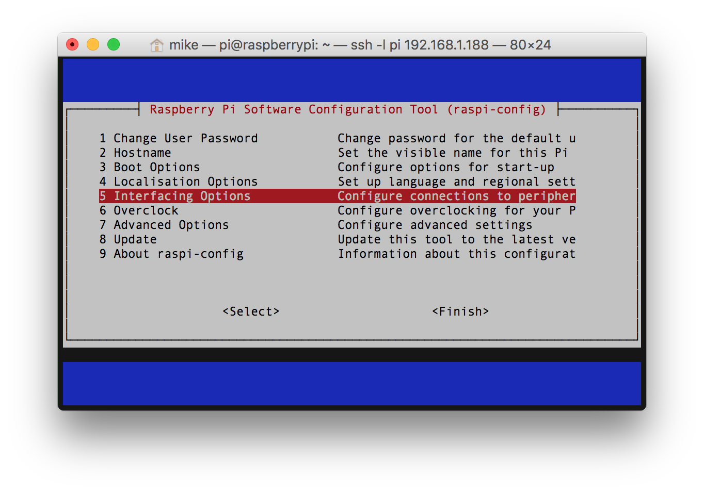
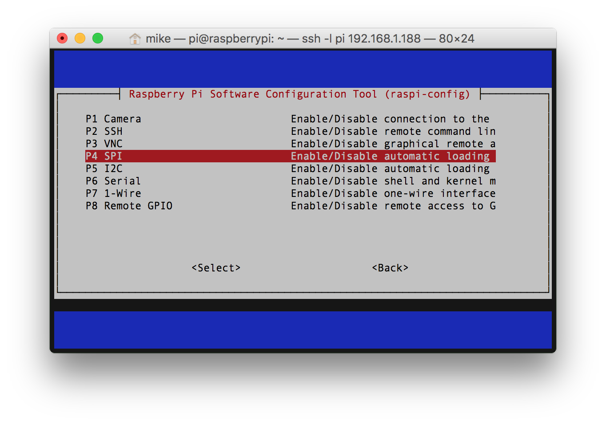
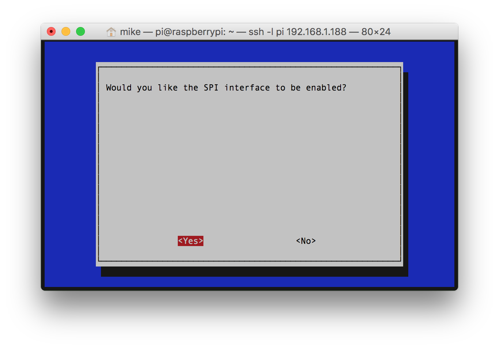

# Raspberry Pi Thermocouple Hat
This is a [Raspberry Pi B+ Hat](https://github.com/raspberrypi/hats) PCB that supports:
* Three MAX31855 Thermocouple Converters for remote temperature sensing
* DS18S20 1-Wire Thermometer for local hat temperature
* DS3231M I2C Real Time Clock for keeping the time when Raspberry is not connected to the internet

PCB is designed in [KiCad](http://kicad-pcb.org) which is a great free EDA toolset and is based on [RPi_Hat_Template](https://github.com/xesscorp/RPi_Hat_Template) by XESS Corp.

You can order parts from Mouser using this [shared BOM](http://www.mouser.com/ProjectManager/ProjectDetail.aspx?AccessID=00ba6ee981).

## Status
Board has been ordered from OSH Park, assembled, and tested. The only issue I had was the DS18S20 footprint is a bit small but it does work.

[](https://oshpark.com/shared_projects/kyDU2zJh)

## Board Preview


## Raspberry Pi Setup
This setup makes two key assumptions. First you are using Raspbian Jessie. Second Python3 is the target programming environment. Python3 should be installed by default but if it isn't run `sudo apt-get install python3-dev`.

### Configure ID EEPROM
Raspberry Pi Hats require an ID EEPROM with data that uniquely identifies every hat ever made. Start by cloning this repository on your Raspberry Pi, building the EEPROM tools, and make the the `eeprom_settings.eep` file.
```
cd ~/Documents
git clone https://github.com/mikelawrence/RPi-Hat-Thermocouple
cd ~/Documents/RPi-Hat-Thermocouple/eeprom/
make all
./eepmake eeprom_settings.txt eeprom_settings.eep
```
The next command writes the freshly generated and unique `eeprom_settings.eep` file to the EEPROM but you must push and hold the write switch on the hat before executing this command. By default the EEPROM on the hat is write protected. Pushing the write switch allows writes to occur while the switch is pushed.
```
sudo ./eepflash.sh -w -f=eeprom_settings.eep -t=24c32
```
You will see the following if writing to the EEPROM was successful.
```
This will attempt to talk to an eeprom at i2c address 0x50. Make sure there is an eeprom at this address.
This script comes with ABSOLUTELY no warranty. Continue only if you know what you are doing.
Do you wish to continue? (yes/no): yes
Writing...
0+1 records in
0+1 records out
117 bytes (117 B) copied, 2.31931 s, 0.1 kB/s
Done.
```
This is what you will see if there is a problem communicating with the EEPROM.
```
This will attempt to talk to an eeprom at i2c address 0x50. Make sure there is an eeprom at this address.
This script comes with ABSOLUTELY no warranty. Continue only if you know what you are doing.
Do you wish to continue? (yes/no): yes
Writing...
dd: error writing ‘/sys/class/i2c-adapter/i2c-3/3-0050/eeprom’: Connection timed out
0+1 records in
0+0 records out
0 bytes (0 B) copied, 0.0539977 s, 0.0 kB/s
Error doing I/O operation.
```
If you succesfuly wrote the EEPROM there is nothing else left to do here.

### Setup Interfaces
For this Hat you will need to enable the SPI, I2C and 1-Wire interfaces. From the command line type
`sudo raspi-config ` and follow the prompts to install SPI support in the kernel.



Now follow the same actions but enabling the I2C and 1-Wire interfaces.

It's time to reboot your Raspberry Pi with `sudo reboot`.

### Configuring the DS3231 RTC
Now let's see if the RTC is is present on the I2C bus by running `sudo i2cdetect -y 1`. If you get a `command not found` you will need to install it with `sudo apt-get install python-smbus i2c-tools`. Looking at the output of the `i2cdetect` command you will see `68` in a field of `--` when the RTC is detected on the bus.
```
pi@raspberrypi:~ $ sudo i2cdetect -y 1
     0  1  2  3  4  5  6  7  8  9  a  b  c  d  e  f
00:          -- -- -- -- -- -- -- -- -- -- -- -- --
10: -- -- -- -- -- -- -- -- -- -- -- -- -- -- -- --
20: -- -- -- -- -- -- -- -- -- -- -- -- -- -- -- --
30: -- -- -- -- -- -- -- -- -- -- -- -- -- -- -- --
40: -- -- -- -- -- -- -- -- -- -- -- -- -- -- -- --
50: -- -- -- -- -- -- -- -- -- -- -- -- -- -- -- --
60: -- -- -- -- -- -- -- -- 68 -- -- -- -- -- -- --
70: -- -- -- -- -- -- -- --                         
```
Enable kernel support for the DS3231 RTC by adding a device tree overlay by running `sudo nano /boot/config.txt` and adding the following to the end of the file. Don't forget to save the file.
```
# Enable Real Time Clock
dtoverlay=i2c-rtc,ds3231
```
Reboot again. Now when `sudo i2cdetect -y 1` is run we see:
```
pi@raspberrypi:~ $ sudo i2cdetect -y 1
     0  1  2  3  4  5  6  7  8  9  a  b  c  d  e  f
00:          -- -- -- -- -- -- -- -- -- -- -- -- --
10: -- -- -- -- -- -- -- -- -- -- -- -- -- -- -- --
20: -- -- -- -- -- -- -- -- -- -- -- -- -- -- -- --
30: -- -- -- -- -- -- -- -- -- -- -- -- -- -- -- --
40: -- -- -- -- -- -- -- -- -- -- -- -- -- -- -- --
50: -- -- -- -- -- -- -- -- -- -- -- -- -- -- -- --
60: -- -- -- -- -- -- -- -- UU -- -- -- -- -- -- --
70: -- -- -- -- -- -- -- --                         
```
The `UU` at address 68 means the RTC is currently in use by a driver or in other words we have success! Now disable the fake hwclock because it will interfere with our new RTC. Issue the following commands.
```
sudo apt-get -y remove fake-hwclock
sudo update-rc.d -f fake-hwclock remove
```
Next run `sudo nano /lib/udev/hwclock-set` and comment out the following lines. This puts the original clock script back to normal.
```
#if [ -e /run/systemd/system ] ; then
# exit 0
#fi
```
### Setting the time in the RTC
First make sure you have installed the CR1225 battery on the Hat. Next verify the Raspberry Pi has the correct time by typing `date`.
```
pi@raspberrypi:~ $ date
Fri Mar 10 16:52:48 CST 2017
```
If the time is not correct connect the Raspberry Pi to a network via Ethernet or WiFi and allow it synchronize with Internet time servers or set the time manually. Once the time is correct issue this command `sudo hwclock -w`. This will set the RTC time to current system time. The next time the Raspberry Pi is booted it will get it's time from the RTC.

### Using the DS18S20 1-Wire Thermometer
[Here](https://github.com/timofurrer/w1thermsensor) is a nice 1-Wire python library that also supports command line reading of the temperature. This library is most likely installed but if not install it with `sudo apt-get install python3-w1thermsensor`.

Now test the Thermocouple Hat's DS18S20 temperature sensor with `pi@raspberrypi:~ $`.
```
pi@raspberrypi:~ $ w1thermsensor all
Got temperatures of 1 sensors:
  Sensor 1 (0008033f727f) measured temperature: 32.312 celsius
```
### Using the MAX31855 SPI Thermocouple Converters
The Thermocouple Hat design gets around the Raspberry Pi limitation of only two chip enables for the hardware SPI0 interface by adding a 74LVC139A 2to4 Decoder to CEO. The address lines of the 2to4 decoder are connected to GPIO24 and GPIO23 so when SPI0.CE0 is sent low only one of the Thermocouple converters will be selected according to the following logic.

| GPIO23 (Pin 16) | GPIO24 (Pin 18) | Thermocouple |
|:---------------:|:---------------:|--------------|
|        0        |        0        | TC1          |
|        0        |        1        | TC2          |
|        1        |        0        | TC3          |
|        1        |        1        | Invalid      |

[Spidev](https://github.com/doceme/py-spidev) is a commonly used Python library for Raspberry Pi SPI programming. This library is most likely already installed but if not install it with `sudo apt-get install python3-spidev`. Assuming you already cloned this repository issue this command `~/Documents/RPi-Hat-Thermocouple/code/test.py` to see the DS18S20 PCB and thermocouple temperatures. Note when I ran the test on my board there was only one connected thermocouple so the other MAX31855K's show as 'No thermocouple connected'.
```
pi@raspberrypi:~ $ ~/Documents/RPi-Hat-Thermocouple/code/test.py
Press Ctrl-C to quit.

DS18S20 on PCB: 31.94C / 89.49F
Thermocouple 0: 23.49C / 74.28F
Thermocouple 1: Error - No thermocouple connected
Thermocouple 2: Error - No thermocouple connected
```
# Acknowledgments
[Adafruit](www.adafruit.com) released a guide to [configuring a RTC on a Raspberry Pi](https://cdn-learn.adafruit.com/downloads/pdf/adding-a-real-time-clock-to-raspberry-pi.pdf) that was extremely helpful is setting up the DS3231M RTC. The MAX31855 code is based on an Adafruit [library](https://github.com/adafruit/Adafruit_Python_MAX31855).

Adafruit has breakout boards for the key chips on this Hat here: [RTC](https://www.adafruit.com/products/3013) and [MAX31855](https://www.adafruit.com/products/269). They support the open soruce/hardware community so support them.
